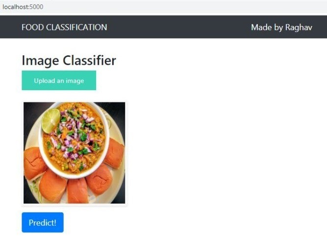
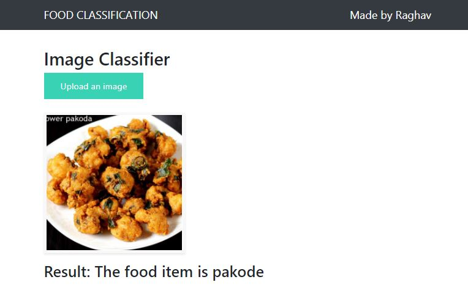

# Image classification for Indian Food using Deep Learning

This project focuses on food classifier to classify 20 exotic Indian food items. 
<b>Accuracy -</b> 90% for train and 95% for test dataset.

The dataset can be found on [Kaggle.](https://www.kaggle.com/l33tc0d3r/indian-food-classification/)

## Process

Workflow of things are as below:

1. Data preparation - Cleaned misspelled labels of images and did Data Augmentation for standardization. 
2. Data Analysis and Splitting of data into Train,Test,Val using splitfolders.
3. Transfer Learning: Training pre-trained CNN (ResNet).
4. Training my own CNN to compare results and optimizing it.
5. Creating flask web application for UI.

## Food Items Identified

| S.no | Item Name     | S.No. | Item Name     |
|------|---------------|-------|---------------| 
|  1   | Burger        | 11    | Kathi Rolls   |
|  2   | Butter Naan   | 12    | Kadhai Paneer |
|  3   | Chai          | 13    | Kulfi         |
|  4   | Chapati       | 14    | Masala Dosa   |
|  5   | Chole Bhature | 15    | Momos         |
|  6   | Dal Makhni    | 16    | Pani Puri     |
|  7   | Dhokla        | 17    | Pakode        |
|  8   | Fried Rice    | 18    | Pav Bhaji     |
|  9   | Idli          | 19    | Pizza         |
|  10  | Jalebi        | 20    | Samosa        |

## Web App - Flask

It is contained in <i>app.py</i>

### <li> User Interface </li>

<ol type="i">
<li>Image can be browsed from laptop locally after downloading it.</li>
<li>The web page previews the same image selected by user.</li>
<li>Hit prediction button to display the food item.</li>
 

</ol>

### <li> Predictions of random google images </li>

    
    
    

